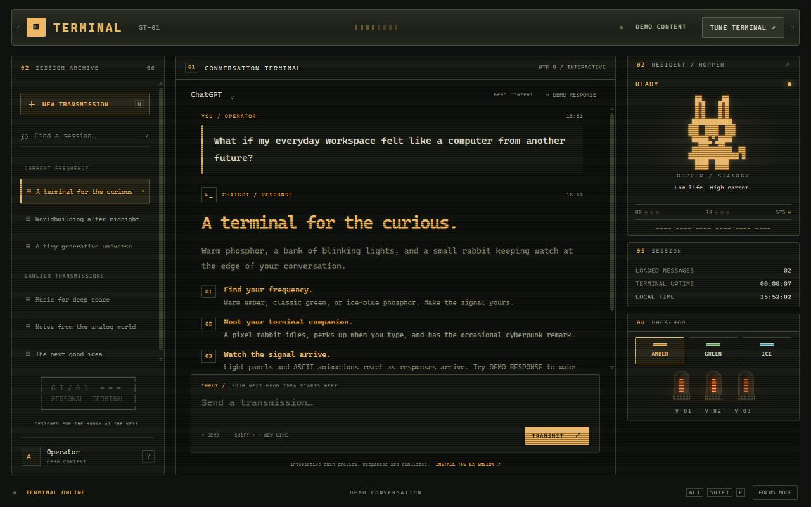
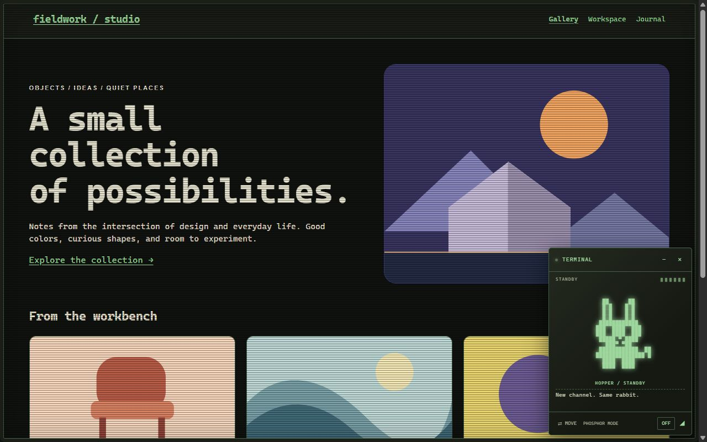
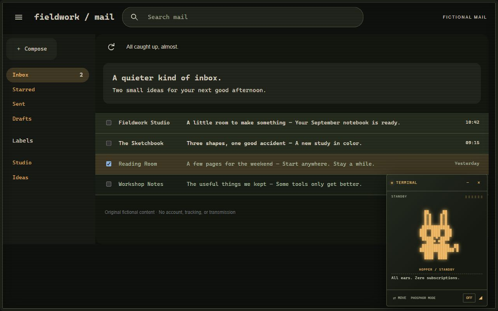

# Goshen Terminal · GT—01

*Cyberdeck vibes for ChatGPT and the tabs you choose — just for fun.*

Turn familiar websites into a vintage terminal, with phosphor colors, glowing instrument panels, and a resident pixel rabbit named HOPPER. ChatGPT gets a dedicated terminal layout; other websites keep their own layout under the theme.

**Early preview for Chrome.** [Install Goshen Terminal from the Chrome Web Store](https://chromewebstore.google.com/detail/jlhlihmmbllkllglociipkhafbpmhcle).

**0.3.5 · Free · Unlisted · Published September 10, 2026.** The unlisted extension is available through the direct link above.

**Your conversation, on a different frequency.** ChatGPT gets its own terminal frame, instrument rail, and animated response indicators.

**Take the terminal with you.** Turn the terminal on for a tab, choose its phosphor color, and give HOPPER a place on your screen.

**A little order in the inbox.** The Gmail treatment gives navigation, search, and message rows distinct surfaces. This screenshot uses fictional mail.

These screenshots use fictional demo content and the extension's maximum settings: **Scanlines 40** and **Glow 60**.

**0.3.6 submitted for Chrome Web Store review.** This version removes prompt/conversation text inspection and adds explicit removal of optional cross-site access. The store still distributes 0.3.5, and automatic publication of the update is disabled. The maintainer explicitly approved proceeding with installed Chrome checks unverified; see [the verification record](docs/TESTING.md). After updating, refresh open pages so they use the new page scripts.

## Make it yours

- Choose **amber, green, or ice**, then adjust glow, scanlines, and text size.
- Keep the full ChatGPT instrument rail or switch to a focused conversation layout.
- Use **TERMINAL COLORS** on other websites, or **FRAME ONLY** to keep their original colors and fonts.
- Watch HOPPER idle, blink, and react to typing and visible activity. Click the rabbit for a headpat.
- Turn ambient animation and rabbit quips on or off independently, or follow your system's reduced-motion preference.

HOPPER's quips are prewritten, and its activity lights are decorative. They do not reveal hidden AI reasoning or measure response progress.

## Install the preview

Requires **Chrome 106 or newer**.

1. Open [Goshen Terminal in the Chrome Web Store](https://chromewebstore.google.com/detail/jlhlihmmbllkllglociipkhafbpmhcle) and choose **Add to Chrome**.
2. Pin **Goshen Terminal** from Chrome's Extensions menu.
3. Refresh an existing ChatGPT tab, or open the extension popup on another website and choose **TERMINAL ON**.

### Manual installation for development

1. Download or clone this repository and keep its `extension` folder somewhere permanent.
2. Open `chrome://extensions` in Chrome and turn on **Developer mode**.
3. Choose **Load unpacked** and select the `extension` folder containing `manifest.json`.
4. Pin **Goshen Terminal** from Chrome's Extensions menu.
5. Refresh an existing ChatGPT tab, or open the extension popup on another website and choose **TERMINAL ON**.

If you have a packaged extension ZIP, extract it first and select the extracted folder containing `manifest.json`. To update an unpacked installation, replace its files, click **Reload** on Chrome's extensions page, and refresh your tabs.

## Using the terminal

ChatGPT is styled automatically while **Automatic on ChatGPT** is enabled. Use the extension popup or **TUNE TERMINAL** to adjust its appearance.

On other websites, the terminal belongs to the tab you activate. It stays with that tab through reloads and navigation within the same site. Turning it off restores the page and clears that tab's activation. Closing the tab also clears it.

**Follow this tab across sites** is optional. Chrome asks for broader website access before it can work. That permission applies across Chrome, but the terminal still follows only the individual tabs where you enable the option. If access is paused, reopen the popup and choose **ALLOW WEBSITE ACCESS** to retry. Turning Follow off stops that tab's following but leaves Chrome's permission in place. In 0.3.6, **REMOVE CROSS-SITE ACCESS** revokes the optional grant for every tab; automatic ChatGPT access is separate.

In universal mode, drag HOPPER's title bar to move the window or its lower-right grip to resize it. Both controls also support arrow keys, **Shift** for larger steps, and **Home** to reset. Position and size last for the current page only.

## Compatibility

This is an early preview, and websites can have styling that conflicts with the theme. If a page looks wrong, try **FRAME ONLY** or **TERMINAL OFF**. Reloading alone may reapply an active theme.

- A page may briefly show its native white or light background while loading, before the theme can be applied.
- Dark logos and colored text can have imperfect contrast. Images, canvas interfaces, embedded media, and some isolated page components retain their native appearance.
- Chrome's internal pages, the Chrome Web Store, extension pages, and local files cannot use universal mode.
- Embedded Gmail Chat has an unresolved freeze/blank-view report; its responsiveness is not verified.
- ChatGPT voice, uploads, canvas, and every native menu are not comprehensively covered.

See the [compatibility and verification matrix](docs/TESTING.md) for the published release's tested scope and the 0.3.6 candidate's outstanding installed-browser checks.

## Verify the source and package

Goshen runs packaged JavaScript and CSS directly, with no compiler or minifier. See [source and package verification](docs/VERIFYING.md) for reproducible ZIP checksums and a local file comparison. Matching hashes establish byte identity, not proof that software is safe.

## Privacy

The extension runs locally, with no analytics, remote code, API keys, or conversation archive. Appearance preferences stay on your device. Active tab IDs, origins, and follow choices stay in session memory; full page addresses and conversation text are not saved. See [PRIVACY.md](PRIVACY.md) for the exact page access and storage behavior.

## Feedback and contributions

Found a page that needs attention? [Report an issue](https://github.com/arussin/goshen/issues) with the site, Chrome version, and steps to reproduce it. Remove account information and private content from screenshots.

[Contributing](CONTRIBUTING.md) covers local development and release checks. The [architecture](docs/ARCHITECTURE.md) and [design notes](DESIGN.md) describe how it works; [SECURITY.md](SECURITY.md) explains security reporting.

## License

Copyright 2026 Adam. Distributed under the [MIT License](LICENSE).

Goshen Terminal is independent of OpenAI and Google. ChatGPT and Chrome are trademarks of their respective owners.
